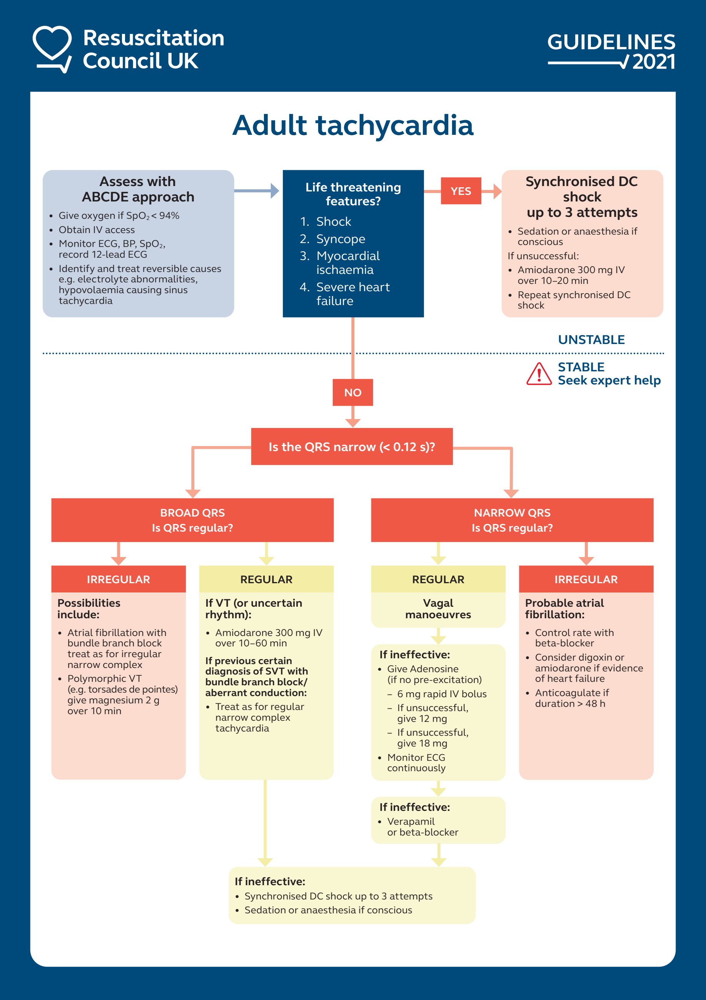
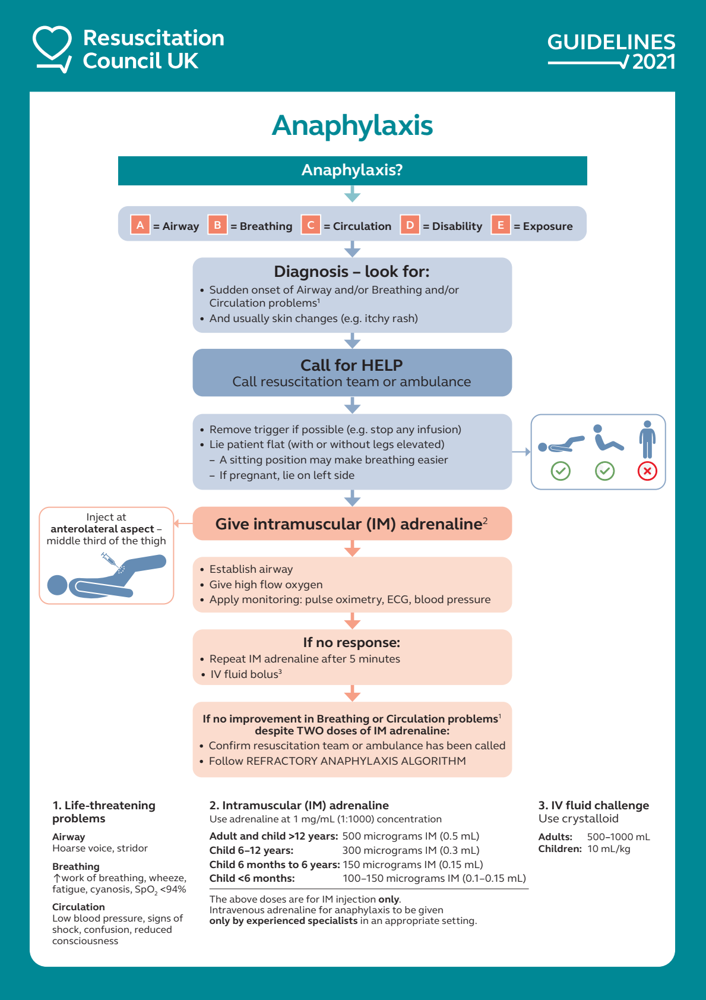
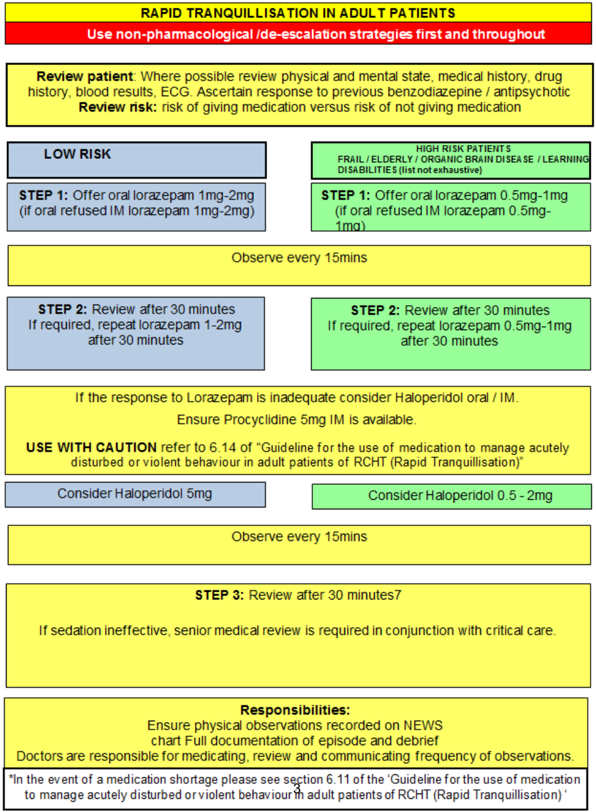
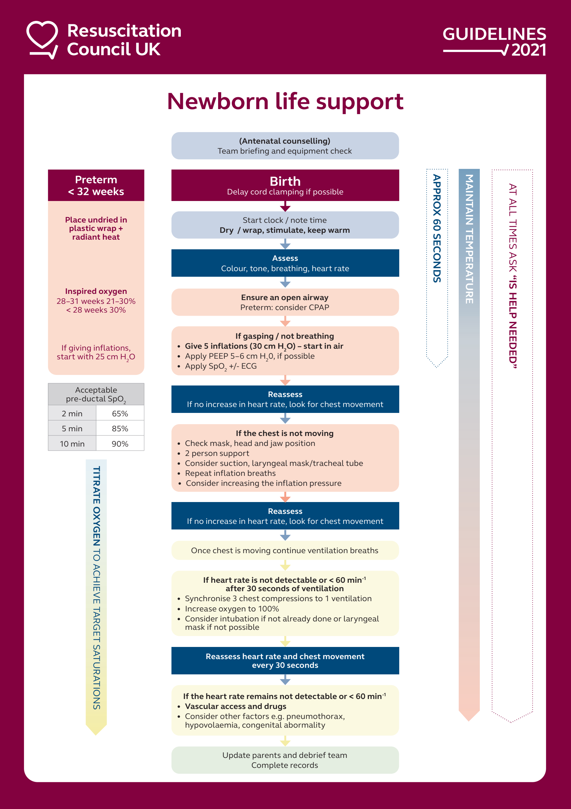
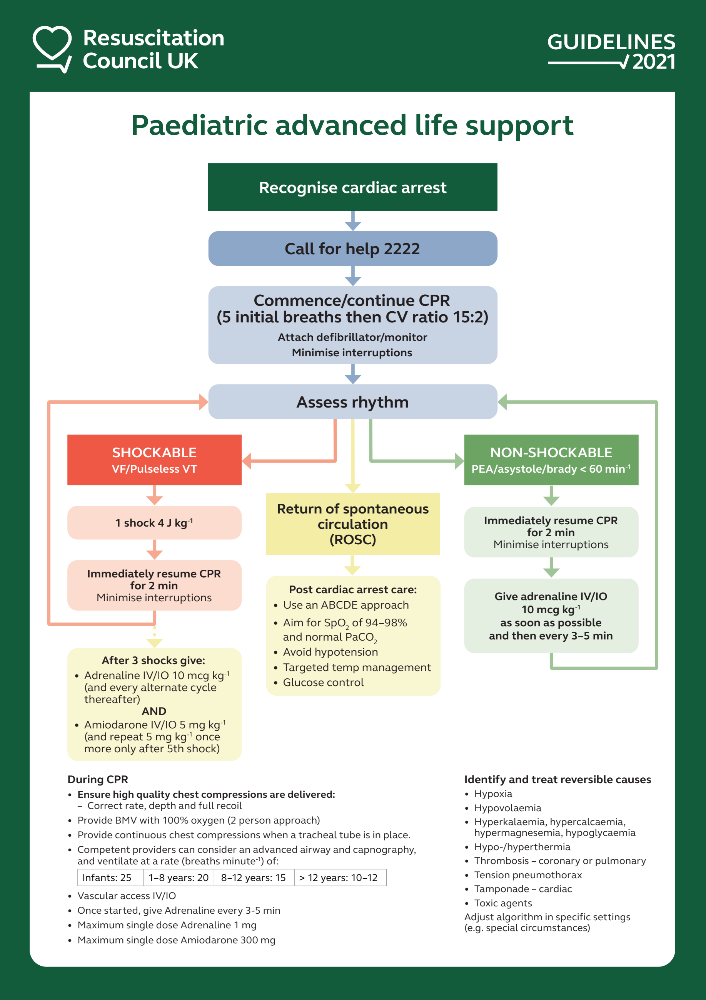
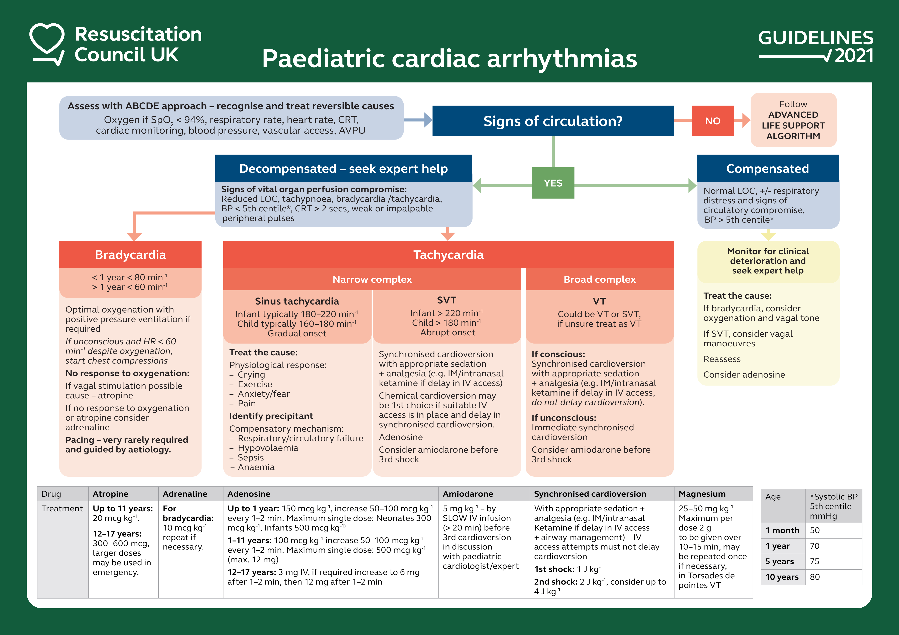

# Emergency
## - [Anaphylaxis](anaphylaxis.md)
## - [Bradycardia](Bradycardia.md)
## - [Cardiac Arrest](Cardiac%20Arrest.md)
## - [Major Haemorrhage](Major%20Haemorrhage.md)
## - [Newborn ALS](Newborn%20ALS.md)
## - [Paediatric Arrhythmia](Paediatric%20Arrhythmia.md)
## - [Paediatric Cardiac Arrest](Paediatric%20Cardiac%20Arrest.md)
## - [Paediatric Emergency Drugs](Paediatric%20Emergency%20Drugs.md)
## - [Rapid Tranquilisation](Rapid%20Tranquilisation.md)
## - [Seizure](Seizure.md)
## - [Tachycardia](Tachycardia.md)

## Cardiac Arrest

## Bradycardia

## Tachycardia

## Anaphylaxis

## Major Haemorrhage

### ROTEM

See also: [Obstetric Haemorrhage](../Obstetrics/Obstetrics.md#Obstetric%20Haemorrhage)

## Rapid Tranquilisation

Indication:
- Age > 16
- If less restrictive strategies have failed
- If there is a imminent risk of dangerous behaviour which risks the patient or others, or if the patient is exhausted

**High Risk** *: frail, elderly, organic brain disease, learning disability

Lorazepam
- 1 - 2 mg Lorazepam PO/IM (0.5 - 1 mg *)
- Repeat at 30 minutes if required
- Alternative: Diazepam - 5 - 10 mg (2.5 - 5 mg *)

Haloperidol
- 5 mg PO/IM (0.5 - 2 mg *) maximum 10 mg / 24 hours
- Contraindications: NMS, dystonia, severe EPSEs, significant cardiac disease, prolonged QTc, acute alcohol withdrawal, Parkinson's, Lewy Body Dementia; caution in epilepsy
- Acute dystonia, oculogyric crisis, laryngospasm: 5 - 10 mg Procyclidine IM, repeat at 20 minutes if required

**Olanzapine**
- 5 - 10 mg PO/IM
- Avoid in high risk patients*, and not within 30 minutes of a benzodiazepine

## Convulsive Status Epilepticus

## Newborn ALS

## Paediatric Cardiac Arrest

## Paediatric Arrhythmia

## Paediatric Emergency Drugs

