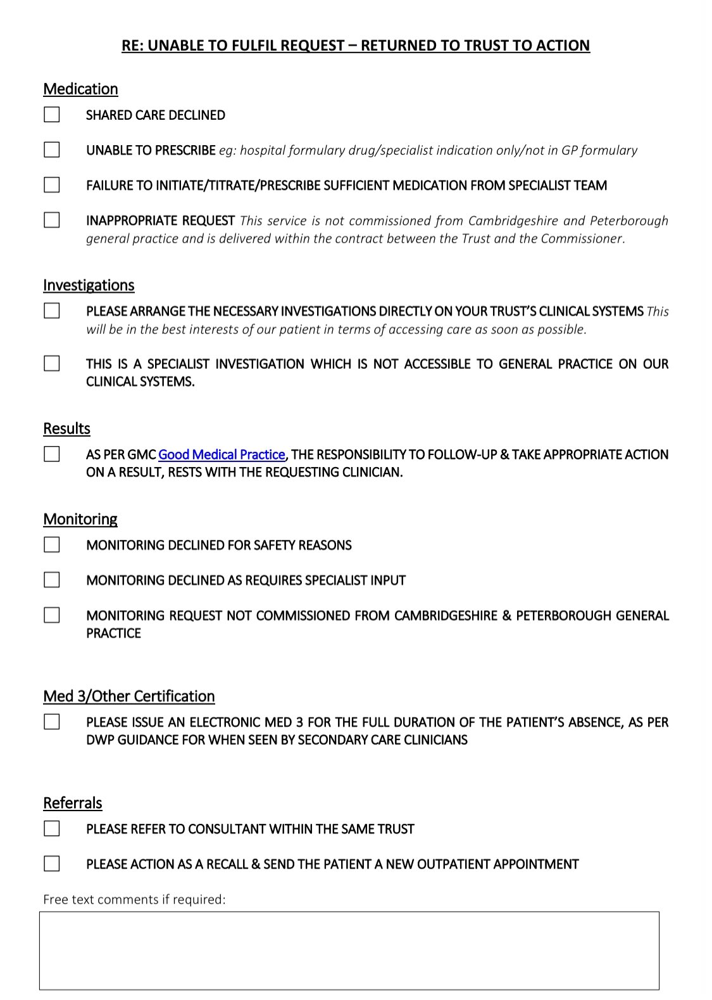

[📄 BMA Form Letters - Pushing Back on Inappropriate Workload](attachments/bma-workload-management-gps-appendix-jul-2022.docx)

[🔗 BMA Guidelines on Inappropriate Workload](https://www.bma.org.uk/advice-and-support/gp-practices/managing-workload/pushing-back-on-inappropriate-workload)

## BMA Letters
### Template response to secondary care work transfer
```
Patient details: Dear X

I refer to your request for this practice to undertake …………. (insert work requested). I enclose a copy of your request (optional).

I am sorry that we are unable undertake this work for the following reason (s): (Use as appropriate)

–      The task(s) is not an essential service as per our GMS/PMS contract

–      This work has not been commissioned by our ICB

–      This work has not been funded as a national or local enhanced service

–      This work is more appropriately provided by yourself as a specialist

You will be aware of the current pressures on general practice, and we unable to undertake unresourced or inappropriate work that is outside our contractual responsibility, and which will as a result jeopardise our core duty of care to patients.

We have informed the patient that this work is not the responsibility of the practice and would be grateful if you would contact them directly to provide the service.

Thank you for your understanding.
```

### Template response to inappropriate prescribing requests
```
Patient details: Dear X

You recently wrote asking us to prescribe the following medication for the above patient. A copy of your request is attached.

We are sorry that in line with our GMC duty of care to patients, we are unable to prescribe this  
medication because:

(Use as appropriate)

–      We do not feel competent and skilled to prescribe this specialist drug. This should be prescribed by a       specialist who can take clinical responsibility for this prescription.

–      The initiation of this drug should be done by a specialist, and the patient stabilised on the medication                 before being considered suitable for a GP to prescribe

–      The request is for unlicenced use of this drug, and which should therefore be prescribed by a specialist              able to take appropriate clinical responsibility

(For shared care requests)

–      We are unable to take on this request for shared care, since we do not feel we have the necessary expertise and skills to take clinical responsibility for the prescribing and monitoring of this  
          specialist medication.

–      We are unable to prescribe this medication under shared care arrangements, since the prescribing of                 this medication has not been commissioned as a shared care enhanced service from this GP practice

**We would be grateful if you would arrange for the patient to receive this medication via the hospital pharmacy or ideally via a hospital FPI0HP.** The patient could then use the latter to collect this medication from their local community pharmacy.

## The practice will be taking no further action with regard to this activity and the transfer of responsibility has not taken place.

**Additional comments:**

```


### Template response to requests to follow up investigations performed in other settings
```
Dear X,

Re: <<Patient Identifier Label>>

We write in response to your letter regarding the above patient requesting that we chase up the …………………………………………. investigations undertaken by your department.

A copy of your request is enclosed.

The result of this investigation will automatically be sent to you or your department as the requesting clinician. Please note that as per GMC guidance, and more recently published NHS England [guidance](#_bookmark10) setting out **Standards for the communication of patient diagnostic test results on discharge from hospital**, it is the responsibility of the doctor requesting a test to take clinical responsibility to follow up and take appropriate action on the result.

We would therefore respectfully request that you follow up the result and take any action accordingly. You will be aware of the pressure general practice is under, resulting from an ever-increasing workload. We would ask that you review your hospital policy on this issue, to avoid practices incurring inappropriate bureaucratic workload of chasing up results which are already in your possession, and which falls under your responsibility.

We will be proceeding on the assumption that you will be taking responsibility for reviewing and taking any action on the above investigation result(s).

Yours faithfully

```

### Template response to requests for post-operative checks


```
Dear x,

Re: <<Patient Identifier Label>>

We write further to your letter of (insert date) requesting that we undertake a post-operative review on the above patient.

This work falls outside the remit of the General Practice contract and has not been commissioned from us as an enhanced service. The best person to undertake such a review is the surgeon who knows what procedure was performed, any difficulties or complications that occurred during surgery, and what post operative complications would be expected, if any. We therefore do not believe it is in the best interests of this patient for us to do this review and are unable to comply with your request.

Pressure on general practice means that we cannot take on inappropriate or unresourced work outside our contract, since this would detract from our core duty of care to patients.
```
### Letter to hospital provider regarding discharge of patients after missed appointment

```
Dear x,

Your department has discharged this patient from your service following missing an appointment.

You have requested that we make a new GP referral for the patient to be seen.

You will be aware that general practice is under unprecedented workload pressures. It is not appropriate for GPs and staff to incur the additional bureaucracy and workload to re-refer patients after a single missed appointment. Additionally many GP appointments are wasted due to patients seeing a GP for the sole administrative purpose of a re-referral, and which could instead have been offered to other patients.

We are asking you to review your policy to either routinely send patients a further appointment, or to allow patients to reinstate their missed appointment within a specified time directly with your appointment department, in order to not incur unnecessary additional bureaucracy on hard pressed GP surgeries.

We have copied our ICB  to inform them of this. We look forward to hearing from you.
```

### Template letter to local ICB  regarding discharge of patients after missed appointment
```
Dear ICB  Chair/CEO

Request to enable patients to directly rebook missed hospital appointments.

We are currently receiving (a high number of/multiple) requests from our local hospital X to re-refer patients who have missed their hospital appointment with a new referral letter.

Patients miss hospital appointments due to a variety of reasons, some due to human error or due to extenuating circumstances.

The automatic process of providers discharging a patient from a clinic after missing an outpatient appointment is punitive to patients, results in needless bureaucracy, and is wasting considerable time for both patients and GPs. It has clinical governance concerns of delays to care or loss of follow up. Further, those patients who have contacted the hospital directly to reinstate their appointment are still told to see their GP for a new referral.

The NHS England commissioned report from NHS Alliance and the Primary Care Foundation ‘Making Time for General Practice’ estimates that 4.5% of GP appointments are utilized for this pure bureaucratic purpose, equating to 15m wasted appointments annually which instead could have been available to ill patients.

We therefore request that you amend local commissioning specifications to require that providers put in place an automatic re-referral system to enable patients to directly rebook a missed appointment, provided they do so within and agreed timeframe eg four weeks, from the date of the non-attendance. This is in line with the recommendations in ‘Making Time in General Practice’, and also with the BMA workload management document ‘Quality First: managing workload to deliver safe patient care’.

At a time when GPs are under overwhelming pressure and which is adversely impacting on access and quality, it is vital that commissioners take action to reduce inappropriate workload in general practice, so that GPs can spend their time attending to the medical needs of their patients.

This step will actually save money, in reducing the unnecessary costs of administration and staff time both in hospitals and general practice, by ending the duplication of re-referring and re-processing referrals.

We have written to hospital X separately to request that they review their policy on this matter, and have copied this letter to our Local Medical Committee.

We look forward to hearing from you.
```

### Template letter to ICB  regarding inappropriate workload transfer

```
Dear x,

INAPPROPRIATE TRANSFER OF WORK TO THIS PRACTICE

We are writing to inform you that the following inappropriate work has been requested from our practice.

Source of inappropriate workload request: Details of request (include copy of letter):

This work is not part of our contractual requirement, nor has it been resourced as an enhanced service. Given the extreme pressures that general practices are under, we are not able to take on this additional and inappropriate work, which will detract from and adversely affect our ability to provide core GP services to patients.

We would ask you to review the service specification with the provider for this particular service to ensure that such work is not inappropriately transferred to general practice in the future.

With many thanks

Cc LMC
```

### Template letter for request to complete non-contractual administrative task
```
Dear x,

We recently received a request from you to carry out (insert description of work, eg questionnaire, or information request requested).

This work is not part of our contractual requirements. You will be aware that general practice is under unprecedented pressure, and therefore we are unable to carry out your request, since this would detract from our ability to provide core contracted services to our patients.
```

### Template response to requests for work absence sick notes for less than seven days

```
Dear x (employer name) (patient details)

We are writing to remind you that it is the responsibility of employees to self-certificate for any absence from work through illness of less than seven days duration.

Unfortunately, pressures on general practice mean that we are having to review our work to ensure that we are able to focus on our key duty of care for patients, and so we are unable to provide sick notes for absences of less than a week.
```


### Template letter to area team regarding delay to information request or payment
```
Dear x,

We are writing to inform you that we have been attempting to

–      obtain information regarding (provide details)

–      chase payments for (provide details):

We have contacted your department since: (details) and have yet to receive a response.

You will be aware that GP practices are under unprecedented workload pressures. It is not acceptable that practices should incur such delays in receiving responses to such requests, and for busy staff to be diverted into the bureaucracy and workload of chasing this up, rather than providing their core services for patients.

Please can we receive a response to our request by…

We have copied the Local Medical Committee to assist us if the information is not forthcoming
```

### Template letter to hospital provider regarding follow up of diagnostic test results following a patient’s discharge from hospital
```
Dear X

We received a copy of patient X’s results on

You will be aware of published NHS England [guidance](https://www.england.nhs.uk/patientsafety/wp-content/uploads/sites/32/2016/03/discharge-standards-march-16.pdf) setting out **Standards for the communication of patient diagnostic test results on discharge from hospital_._** We therefore assume that this is for information only, and that a relevant clinician in your department has actioned this, in keeping with that [guidance](https://www.england.nhs.uk/patientsafety/wp-content/uploads/sites/32/2016/03/discharge-standards-march-16.pdf).

In future, can we suggest that you refrain from sending copies of results to this practice, unless it is of direct clinical relevance, and clearly marked **‘for information only’.**

We have copied our ICB  to inform them of this. We thank you for your understanding.

Yours faithfully
```

### Template letter to ICB  in response to requests to follow up investigations performed in other settings and diagnostic test results following a patient’s discharge from hospital
```
Dear X,

## FOLLOW UP OF DIAGNOSTIC TEST RESULTS FOLLOWING A PATIENT’S DISCHARGE FROM HOSPITAL

We are writing to inform you that we (delete option as appropriate)

a)     have received a copy investigation result from the **X** Department of Hospital **Y**, without confirmation of            being actioned by the requesting hospital clinician.

b)     have been requested to chase up a result of an investigation requested by a hospital clinician

A copy of the above is attached.

In keeping with published NHS England [guidance](https://www.england.nhs.uk/patientsafety/wp-content/uploads/sites/32/2016/03/discharge-standards-march-16.pdf) setting out _Standards for the communication of patient diagnostic test results on discharge from hospital,_ **‘the clinician who orders the test is responsible for reviewing, acting and communicating the result and actions taken to the General Practitioner and patient even if the patient has been discharged.’** This is also in keeping with BMA [joint guidance](http://www.bma.org.uk/support-at-work/gp-practices/service-provision/duty-of-care-to-patients-regarding-test-results) between the BMA general practitioners committee and consultants committee

We therefore request that as the commissioner you require that hospitals adhere to this important standard, and to require that hospital initiated investigations are reviewed and acted on by the requesting clinician or relevant hospital department. Additionally, we  request that you require hospitals to stop sending copies of test results to local GP practices, unless specifically for clinical information in which case they should be clearly marked **‘for information only’.**

With many thanks

cc. Local medical committee
```

## Cambridge Form Letters


