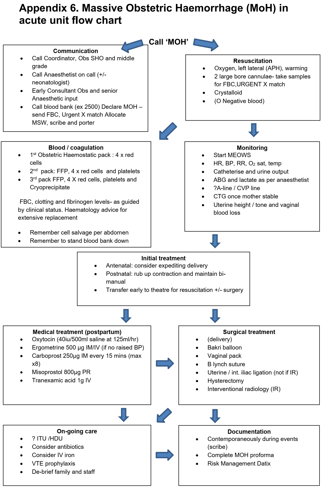
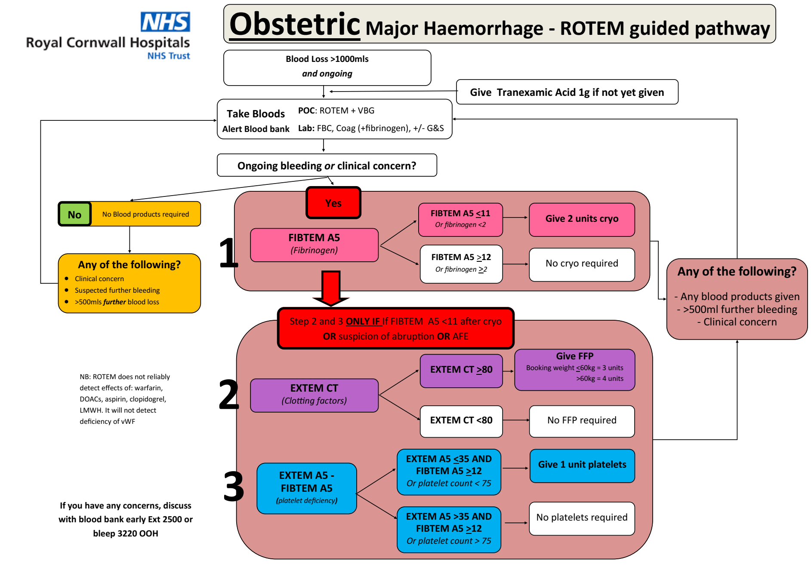

# Obstetrics
## Obstetric Haemorrhage
- Major haemorrhage > 1000 ml
- Massive Haemorrhage > 2000 ml or > 150 ml/min
- Infuse all packs entirely
- Use FBC, Coagulation, ROTEM to guide ongoing resuscitation

### MOH Flowchart

### ROTEM-Guided Haemorrhage Management

### Uterotonic Drugs

- Syntocinon - 5 units loading, then infusion 125 ml/h (40 units in 500 ml saline)
- Ergometrine 500 microg **IM** (ci HTN) - max 2x (included in synto*metrine*)
- Syntometrine - 500 microg Ergometrine + 5 units Syntocinon **IM** (ci HTN)
- Carboprost 250 microg **IM** q15m max 8x (ci Asthma)
- Misoprostol 800 microg PR (ci Asthma)
- TXA 1g IV

## PET and Eclampsia
Aim for Blood Pressure < 150/100

### IV Antihypertensive Agents

#### Hydralazine

- Loading
  - 20 mg Hydralazine in 20 ml saline (1 mg/ml)
  - Discard half, administer 5 ml over 15 min, repeat at 20 mins if required
- Infusion
  - 40 mg Hydralazine in 40 ml saline (1 mg/ml)
  - Infuse 5 ml/h up to 18 ml/h

#### Labetalol

- Infuse 5 mg/ml solution at 4 ml/h (20 mg/h)
- Double every 30 minutes or 160 mg/h

#### Magnesium

- 20 ml of Magnesium Sulphate 20% (4 grams) over 5 minutes
- Infusion 5 ml/h

## Obstetric General Anaesthetic

Sodium Citrate and H2 receptor antagonist

- Thiopentone > 5 mg/kg
- Suxamethonium up to 150 mg
- 1 mg IV Alfentanil if hypertensive
- MAC 1-1.2 with sevo + 50% nitrous

Opioids immediately post delivery

## Epidurals
### Procedure

1. L2/3 or L3/4 interspace
2. Test dose 8ml bag mix (0.1% levobupivacaine + 2mcg/mL fentanyl)
3. Load to 15-20 ml total of bag mix

For CSE:
- A dose of 1ml 0.25% Levobupivicaine or 2 mls of the epidural mix (0.1% levobupivicaine + 2mcg/ml fentanyl)
- epidural in next space up
- don't load the epidural and set up the pump; advise the patient to use the PCA function when they feel the pain developing

### Contraindications

- Declined by woman
- Inadequate midwifery staffing or training
- No CTG or inadequate monitoring of fetus
- Local infection at proposed site of insertion
- Raised intra-cranial pressure
- Uncorrected hypovolaemia
- Coagulopathy (platelets must be > 80, INR < 1.4)
- Anticoagulant therapy (wait 12h from prophylactic dalteparin, 24h if > 5,000 units)
- Spina bifida occulta (unless magnetic resonance imaging (MRI) scan shows normal anatomy)

### Timing of Anticoagulants

- Dalteparin < 5,000 units
  - wait 12 hours before insertion / removal of catheter
  - wait 4 hours after insertion / removal before administering Dalteparin
- Dalteparin 100 units/kg
  - Wait 24 hours before insertion / removal of catheter

### Troubleshooting

- **Missed segment** – lie the woman affected side down and give a bolus of 10 ml low-dose mix (e.g. 10 ml 0.1% bupivacaine + 2mcg/ml fentanyl) or 5 +5 ml 0.25% bupivacaine. If no improvement manage as for unilateral block.
- **Unilateral block** – withdraw the catheter by 1 – 2 cm and give a further dose of low-dose mix (e.g. 10 ml 0.1% bupivacaine + 2mcg/ml fentanyl) with the woman lying with the affected side down. If this fails to improve pain relief consider re-siting the epidural.
- **Patchy block** – consider a top-up with fentanyl 50-100 mcg in 10 ml 0.9% sodium chloride to improve spread. A stronger dose of local anaesthetic (see above) may also be required. Consider the possibility of a subdural block (see below).
- **Persistent perineal pain** – consider giving a bolus of fentanyl 50-100 mcg or clonidine 50-75 mcg and/or a sitting bolus top up of 5-10mls 0.25% Levobupivicaine.

### Accidental Dural Puncture

**Immediate**

1. Attempt to thread the catheter 3 cm into the subarachnoid space, unless limited by pain or paraesthesia
2. Clearly label the _intrathecal_ catheter
3. Administer 0.25% Levobupivicaine 1ml + 25 microg Fentanyl + 2 ml 0.9% saline flush
4. Repeat doses of 0.5 - 1.5 ml 0.25% Levobupivacaine q1-2h with 2ml 0.9% saline flush
5. Inform mother, midwifery, and obstetrics teams

### Epidural Top Up

- Epidural top up of 20 ml: 10 ml 2% Lidocaine + 10 ml 0.5% Levobupivacaine
- Administer in divided doses of 5 ml
- At the end of surgery or before removal of the epidural catheter give: 3mg diamorphine or 3mg preservative-free morphine
- If unable to effectively top-up epidural, give spinal with ~30% reduction in levobupivacaine dose

## C-Section

### Elective

- Spinal: 2.4-2.6 ml 0.5% Heavy Bupivacaine + 300mcg diamorphine or 15-20 mcg fentanyl + 100 mcg preservative free morphine
- Insufficient spinal?: expedite, alfentanil, local in incision, offer GA
- Phenylephrine 100 microg/ml i.v. at 20-30 ml/h
- For CSE: At 45 minutes post spinal, give 5 ml 0.5% levobupiv aiming for 20 to cover spinal wearing off

### Emergency

- Consider Terbutaline 250 microg s.c. to relax uterus
- Carbetocin 100 microg i.v. post-delivery
- If syntocinon infusion ongoing - 5 units syntocinon and infusion (125 ml/h of 40 units in 500 ml saline)
