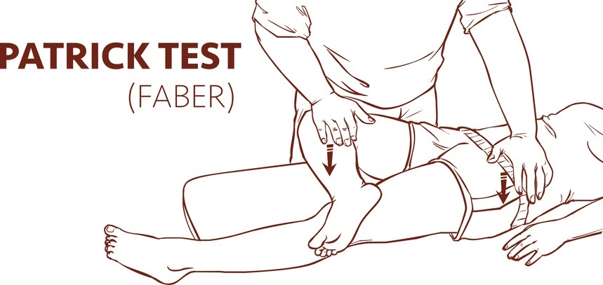

# Limping Child

## History
- Trauma 
- Precipitating events: viral infection preceding transient synovitis or reactive arthritis
- Associated muscle weakness? neuromuscular disease
- Birth and Developmental History: breech, family history of hip dysplasia, walking history, delay in motor milestones, regression

## Examination
Gait
- Antalgic 
- High-stepping - neurological conditions
- Tiptoe - limb length discrepancy or congenital talipes
- Trendelenburg gait - developmental dysplasia of the hip
- Circumduction - limb length discrepancy

FABER (Flexion, Abduction, and External Rotation) test: groin pain indicates a hip problem, pain in the SI area suggests sacroiliac joint disease
## Red Flags
- Pain waking the child at night - Malignancy
- Signs of redness, swelling, or stiffness of the joint or limb - Infection or inflammatory joint disease
- Weight loss, anorexia, fever, night sweats, or fatigue - Malignancy, infection, or inflammation
- Unexplained rash or bruising - Haematological or inflammatory joint disease, or non-accidental injury
- Limp and stiffness worse in the morning - Inflammatory joint disease
- Severe pain, anxiety, and agitation after a traumatic injury - An evolving compartment syndrome

## Differential

**All ages**
- Fracture/soft-tissue injury
- Cellulitis
- Non-accidental injury (NAI)
- Neoplasm
- Septic arthritis
- Neuromuscular
- Osteomyelitis

**Age 1–3 years**
- Septic hip  
- Developmental dysplasia of the hip (DDH)  
- Toddler’s fracture  

**Age 4–10 years**
- Perthes’ disease  
- Transient synovitis

**Age 11–16 years**
- Slipped capital femoral epiphysis (SCFE)  
- Juvenile rheumatoid arthritis  
- Osteochondritis dissecans  
- Osgood–Schlatter disease

### Developmental Dysplasia of the Hip (DDH)
Congenital condition of abnormal hip joint development

Occurs more commonly in firstborn children, in those with a family hostory, breech presentation

Examination findings: asymmetric skin folds, limb shortening, and reduced hip abduction

If untreated can develop to osteoarthritis

## Sources

* RCGP EKUL: The limping child: when to worry and when to refer
* The limping child — when to worry and when to refer: a GP’s guide; Hassan Raja, Shehzaad A Khan and Abdul Waheed; British Journal of General Practice 2020; 70 (698): 467. DOI: https://doi.org/10.3399/bjgp20X712565