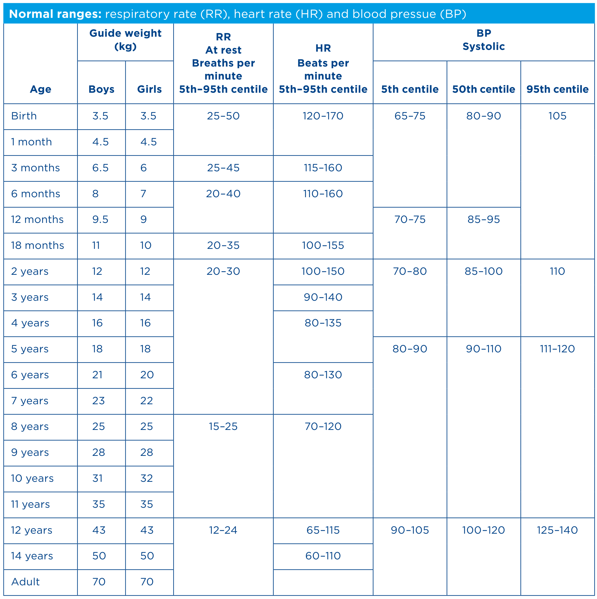

# Paediatric Observations Normal Ranges

NB: One degree of fever adds 10 beats per minute to heart rate

Source: [RCN Standards for Assessing, Measuring and Monitoring Vital Signs in Infants, Children and Young People](https://www.rcn.org.uk/professional-development/publications/pub-005942)