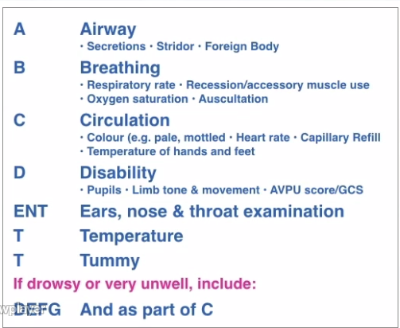
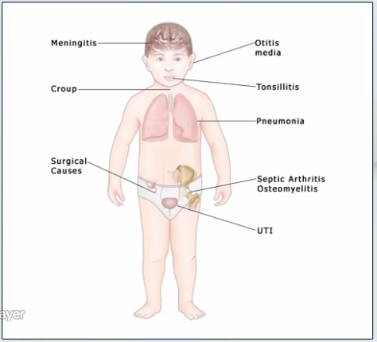
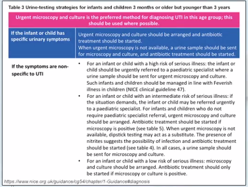
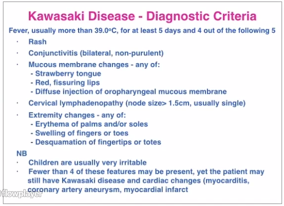

# Fever
## Symptoms
Febrile illness of 5 or more days is suggestive of a significant infection, ie UTI, or alternative diagnosis such as Kawasaki disease

High fever, lethargy, and anorexia are non-specific and can occur in mild and severe illness

Ask about temperature, changes in behaviour (babies can be drowsy / irritable with severe illness, clingy for older children), appearance (colour), eating and drinking

If the child's behaviour fails to improve when the fever is controlled with antipyretics, and they remain drowsy or irritable despite a normal temperature, this is a red flag

General History: prematurity, other conditions, steroids, vaccinations etc

Note that children often don't display the 'classic' localising symptoms for specific infection ie UTI / pneumonia

Children under 2 years are at increased risk of bacterial infection due to immune immaturity, with children under 18 months being very high risk

## Signs and Examination
The purpose of examination is to assess the severity of the illness, in particular signs of sepsis, and identify a focus of infection

### Haemodynamic Assessment / Sepsis

[Paediatric-Observations-Normal-Range](Paediatrics/Paediatric-Observations-Normal-Range.md)

[Traffic Light](Paediatrics/Traffic%20Light.md)

Developing septicaemia causes haemodynamic changes which can be identified on clinical examination

Peripheral vasoconstriction preserving central perfusion, with prolonged peripheral capillary refill time and cold peripheries

Progressing to pallor, drowsiness, tachypnoea

Hypotension is a late consequence

- A/B/C - evidence of septicaemia / circulatory failure / shock
  - Mottling (can be normal in some children - ask the parents)
  - Pallor
  - Peripheral cooling
  - Tachycardia and Tachypnoea
  - Hypotension is a very late stage sign in children
- D - alert, irritable, drowsy - assess their general behaviour
- Hypoglycaemia can occur in sepsis

### Temperature and Fever

In general, we are more worried about fevers greater than 39.5 degrees centigrade. Except in babies 0-3 up to months old, when a fever of over 38 degrees should be considered significant

The correlation between illness severity and temperature is weak

The purpose of an antipyretic is to reduce fever and allow behaviour and physiology to be re-assessed for signs of underlying severe infection. If a child remains subdued despite fever being controlled this is a concerning sign.

Tight fever control doesn't prevent febrile convulsions

Fever can induce tachycardia and tachpnoea (1 Centigrade of fever adds 10 bpm to heart rate) - but if these persist after antipyretic administration, or are disproportionate to the fever, they can be signs of septicaemia

### Focus of Infection

Assess the child top-to-toe

- Rashes
- Meningitis: Bulging fontanelle, Neck stiffness (unreliable, and late), Photophobia
- Runny nose (coryza)
- Ears and Throat
  - Tympanic redness can be seen in any cause of fever; only diagnose otitis media if there is a fluid level behind the drum, or the one drum is dull and non-reflective
  - Tonsillar swelling and redness can occur regardless of cause, only diagnose tonsillitis if there is significant enlargement and exudate
- Respiratory distress
- Abdomen
- Urine sample

## Initial Investigations
A base excess of more than -3 or a lactate of more than 3 are significant in this situation - signs of significant sepsis

Raised WCC seen in early bacterial infection, CRP can 'lag' in it's response

## Differential
- Infection: bacterial, viral
- Non-infectious: juvenile onset arthritis, Kawasaki disease

## Red Flags
### Pneumonia
See also: [Dyspnoea](Paediatrics/STSC/Dyspnoea.md)

Pneumonia is clinically subtle in young children and often requires radiography to diagnose

Often anorexic and lethargic, febrile, and tachycardic, tachypnoeic, and hypoxaemic

Signs of respiratory distress: tachypnoea, accessory muscles, recession

Auscultation is often unreliable

### Urinary Tract Infection (UTI)

If no focus of infection has been elicited, consider a UTI

Pyelonephritis can often occur in younger children

Clean-catch urine is required for diagnosis - leukocytes / nitrites suggest infection

### Bone and Joint Infection

Septic arthritis and osteomyelitis are common in children < 2 years

Redness and swelling of the joint may be absent

### Kawasaki Disease

Can cause long-term cardiac and vascular complications if untreated

### Meningitis and Meningococcal Sepsis

Several bacteria and viruses can cause septicaemia and/or meningitis

Meningitis:
- Fever
- Vomiting
- Constant Headache
- Bulging Fontanelle
- Neck Stiffness 
- Photophobia
- Difficult to wake, confused, delirious
- Seizures

Meningococcal Septicaemia:
- Fever / Hypothermia
- Rigors
- Rash - non-blanching rash > 2 mm (purpura), may be absent or blanching in the early stages
- Tachycardia
- Tachypnoea
- Pallor (peripheral CRT > 3 sec)
- Peripheral cooling
- Drowsiness, confusion, delirium

IM or IV Antibiotics (penicillin, ceftriaxone) are indicated ASAP

## Management
Most children under 2 years with fever will be hospitalised

### Safety-Net Advice
Discharge information and safety-netting can be found in the [NICE Guidelines](https://www.nice.org.uk/guidance/ng143/chapter/Recommendations#advice-for-home-care)

See also the [discharge advice template](./attachments/discharge-advice-template-msword-6963838237.doc )

> Following contact with a healthcare professional, parents and carers who are looking after their feverish child at home should seek further advice if:
> 
> -   the child has a fit    
> -   the child develops a non-blanching rash
> -   the parent or carer feels that the child is less well than when they previously sought advice
> -   the parent or carer is more worried than when they previously sought advice
> -   the fever lasts 5 days or longer
> -   the parent or carer is distressed, or concerned that they are unable to look after their child

## Resources

- [NICE Fever in under 5s: assessment and initial management](./attachments/NICE-fever-under-5.pdf)
- [Seasonal influenza: guidance, data and analysis](https://www.gov.uk/government/collections/seasonal-influenza-guidance-data-and-analysis)
- [NICE Meningitis (bacterial) and meningococcal septicaemia in under 16s: recognition, diagnosis and management](./attachments/nice-meningitis.pdf)
- [meningitis.org](https://www.meningitis.org/)
- [Flowchart - Management of Bacterial Meningitis in Children and Young People](./attachments/management-bacterial-meningitis-children.pdf)
- [Management of Meningococcal Disease in Children and Young People](./attachments/management-meningococcal-disease-children.pdf)
- [Flowchart - Management of Bacterial Meningitis in infants < 3 months](./attachments/management-bacterial-meningitis-infants.pdf)
- [NICE Urinary tract infection in under 16s: diagnosis and management](./attachments/child-UTI-nice.pdf)
- [discharge advice template](./attachments/discharge-advice-template-msword-6963838237.doc)