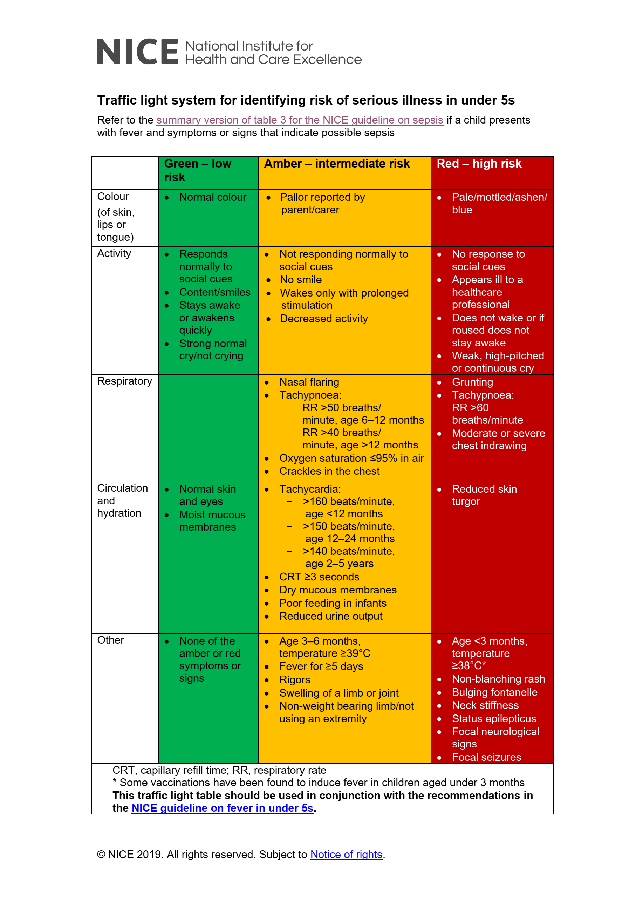

# NICE Traffic Lights
Traffic light system for identifying risk of serious illness in under 5s

All red children should be seen face to face by a clinician with paediatric training

Amber cases should be referred depending on the patient's age, your level of concern, and the family's ability to be manage the child's illness

Amber and red children may require: blood gas, cultures, FBC, x-rays, LP (<1 y/o or meningitic)

TODO: Review the [validity](https://www.pulsetoday.co.uk/news/clinical-areas/paediatrics/nice-traffic-light-guide-for-spotting-serious-child-illness-is-unreliable-finds-study/) of the traffic light system