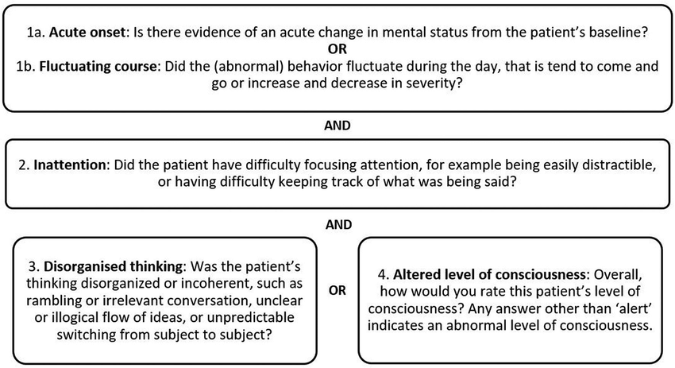

# Delirium
## Diagnosis
Acute confusion with altered conscious level (fluctuating severity, inattention, disorganised thinking)

## Differential
- Electrolytes
- Infection
- Medication
- Head Injury
- Urinary Retention
- Constipation
- Pain

## Investigations

- FBC, CRP, U+E, Bone Profile, LFT, Glucose
- B12, Folate, TSH
- ECG
- Septic Screen - CXR, MSU, ?Blood Cultures
- ?CT Head
- ?LP

## Management
Orient: sleep, consistent staffing, vision, hearing, family

Medication as *last resort* in patients where their symptoms threaten their safety or the safety of others, or to carry out essential investigations or treatment

- Olanzapine 2.5 mg
- Lorazepam 0.5 - 1 mg; maximum 2 mg / 24h
- Haloperidol 0.5 - 1 mg (c.i. Parkinson's)
